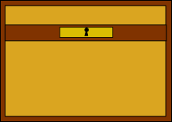
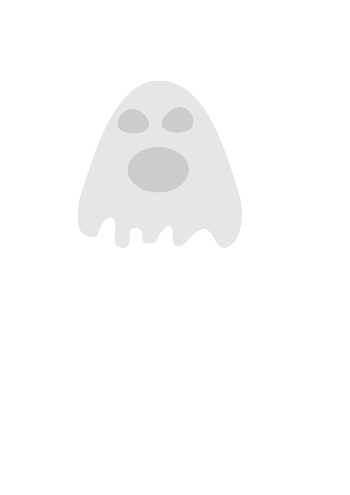

# MeFirstGame
Meu primeiro "jogo" que fiz em html (embora não seja minha área mais especializada) 

<h1> Versão (0.2.0) <a href"https://github.com/joaop2p/MeFirstGame">atual</a></h2>
<h2> O que há de Novo?</h2>

 Realizei algumas mudanças e agora o site está um pouco mais "responsivo", porém se você usar uma resolução muito baixa talvez não fique legal.

<h3> Tesouro</h3>

 Agora você não precisa mais andar um trajeto todo pra nada como antes, com a nova atualização seu objetivo é pegar um tesouro! O que tem dentro dele? Eu não faço ideia! 

<h3> Fantasmas </h3>

 Quem abriu as portas do submundo? Agora esses fantasmas se espalharam pelo meu jogo &#128545;.

<h2> Versão (0.1.0) </h2>
<h4 align="center"> 
    :construction:  Projeto em construção  :construction:
</h4>

